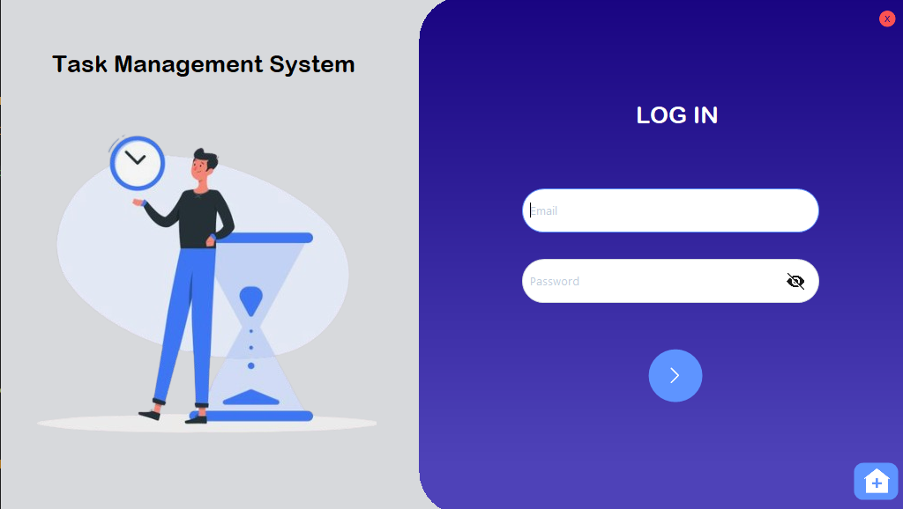
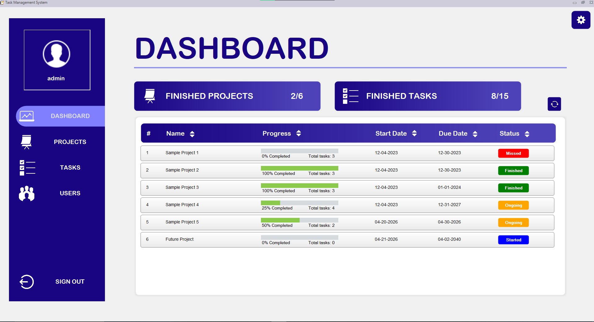
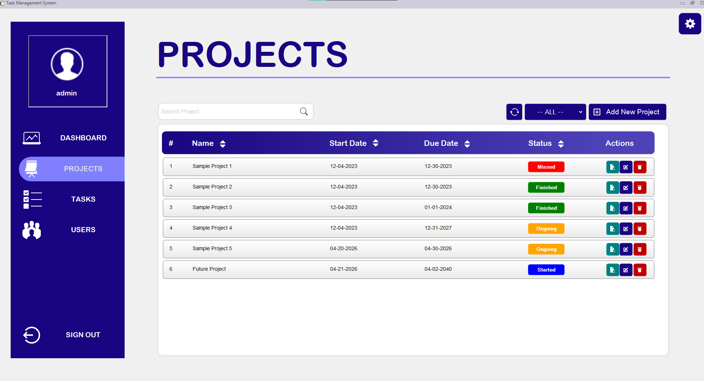
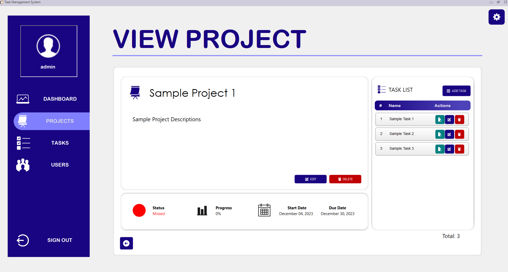
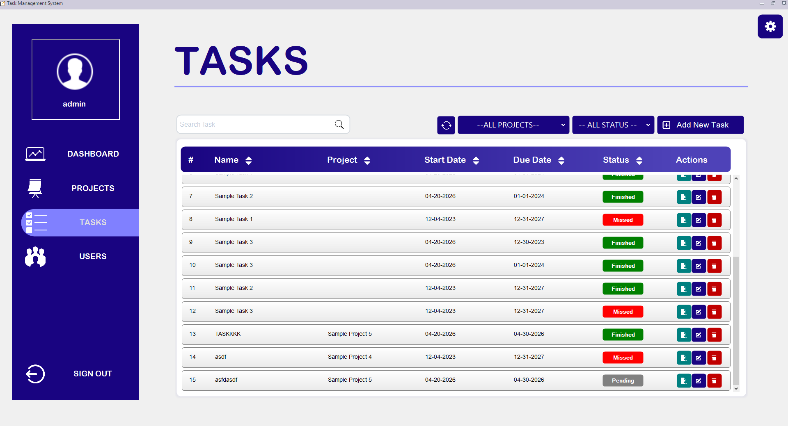
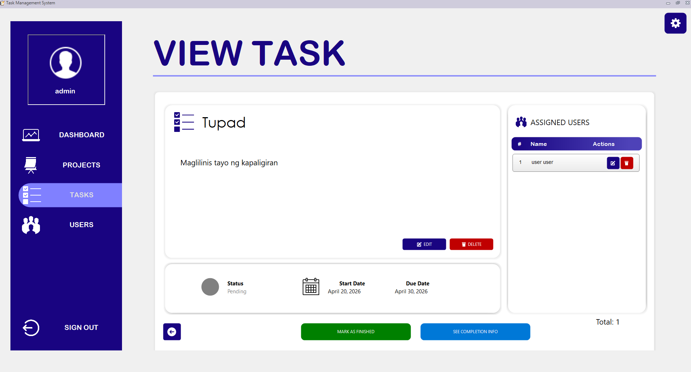
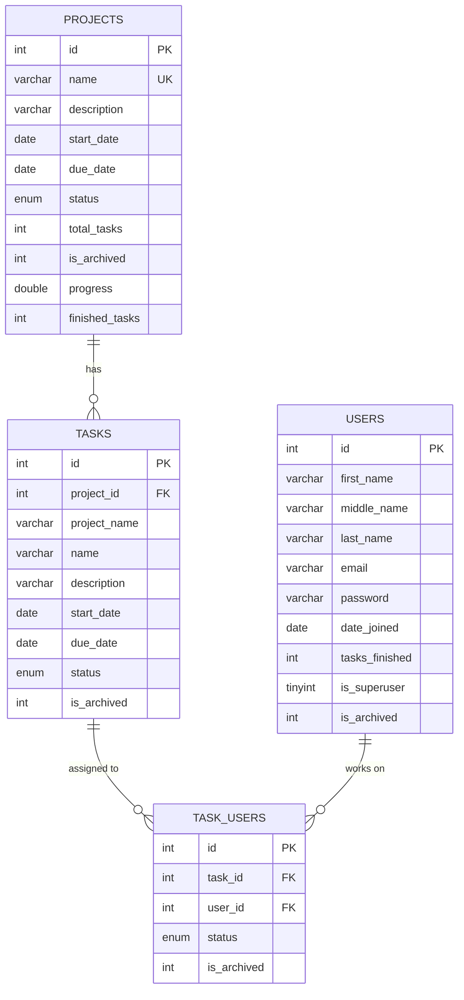

# 📋 Task Management System

<p align="center">
  
</p>

A **Windows Forms desktop application** for managing projects, tasks, and users — built with **C#** and **.NET Framework 4.7.2**. This system supports role-based access control, real-time progress tracking, email-based account recovery, and task completion submissions with image attachments.

> **📚 Academic Project** — 2nd Year College · Data Structures and Algorithms · 2023

---

## ✨ Features

### 🔐 Authentication

- Email and password login
- **Password recovery via email** — sends a 6-digit recovery code using the **SendGrid** API
- Recovery code verification with access to profile editing upon successful recovery
- Role-based access: **Superuser (Admin)** and **Regular User**

<p align="center">
  
  <br>
  <em>Login screen with email & password authentication</em>
</p>

### 📊 Dashboard

- Overview of all projects with progress bars and completion percentages
- Summary counts: finished projects vs. total projects, finished tasks vs. total tasks
- Sortable columns: name, progress, start date, due date, status
- Color-coded status indicators:
  - 🔵 **Started** — No tasks finished yet
  - 🟠 **Ongoing** — Some tasks finished
  - 🟢 **Finished** — All tasks completed
  - 🔴 **Missed** — Past due date and incomplete
- Auto-updates project status based on task completion and deadlines

<p align="center">
  
  <br>
  <em>Dashboard with project overview, progress bars, and color-coded statuses</em>
</p>

### 📁 Project Management

- **Create, edit, and delete** projects (admin only for edit/delete)
- Project fields: name, description, start date, due date
- Unique project name enforcement
- **Search** projects by name
- **Filter** by status: All, Started, Ongoing, Finished, Missed
- **Sort** by name, start date, due date, or status
- Drill-down to view all tasks within a project
- Automatic progress calculation based on task completion
- Soft-delete (archive) — cascades to associated tasks and task-user assignments

<p align="center">
  
  <br>
  <em>Projects list — search, filter by status, sort columns, and manage via action buttons</em>
</p>

<p align="center">
  
  <br>
  <em>Project detail view — description, progress, status indicators, and associated task list</em>
</p>

### ✅ Task Management

- **Create, edit, and delete** tasks (admin only for edit/delete)
- Assign tasks to a project (with auto-populated date ranges from the project)
- **Assign multiple users** to each task via a checklist
- Task fields: name, description, project, start date, due date
- Status tracking: **Pending**, **Finished**, **Missed**
- Automatic "Missed" status when past due date
- **Mark/unmark tasks as finished** (admin only)
- **Task completion form** — users submit a description and an image attachment as proof of completion
  - Image compression for storage optimization
  - Image preview functionality
  - Admins can review and remove submissions
- Role-based task visibility:
  - **Admins** see all tasks across all projects
  - **Regular users** only see tasks assigned to them
- **Search** by task name or project name
- **Filter** by project and/or status
- **Sort** by name, project, start date, due date, or status

<p align="center">
  
  <br>
  <em>Tasks list — filter by project and status, sort columns, and manage via action buttons</em>
</p>

<p align="center">
  
  <br>
  <em>Task detail view — description, assigned users, and options to mark as finished or submit completion</em>
</p>

### 👥 User Management _(Admin Only)_

- **Create, edit, and delete** users
- User fields: first name, middle name, last name, email, password
- Assign admin privileges via checkbox
- Gmail email validation (regex)
- Password confirmation with real-time match feedback
- Duplicate name and email detection
- Track tasks finished per user
- **Filter** users: All, Admins Only, Users Only
- **Search** by name or email
- **Sort** by name, email, tasks finished, or date joined
- Soft-delete (archive) for users

---

## 🛠️ Tech Stack

| Component         | Technology                                                 |
| ----------------- | ---------------------------------------------------------- |
| **Language**      | C# (.NET Framework 4.7.2)                                  |
| **UI Framework**  | Windows Forms (WinForms)                                   |
| **UI Libraries**  | Guna UI2 (modern controls), Krypton Toolkit (form theming) |
| **Database**      | MySQL / MariaDB                                            |
| **DB Connector**  | MySql.Data (MySQL Connector/NET 8.2.0)                     |
| **Email Service** | SendGrid API (v9.28.1)                                     |
| **Environment**   | DotNetEnv (`.env` file support)                            |
| **IDE**           | Visual Studio                                              |

---

## 🗄️ Database Schema

The system uses a MySQL database (`task_management_system_db`) with **4 tables**:



### Status Enums

| Entity   | Possible Values                            |
| -------- | ------------------------------------------ |
| Projects | `Started`, `Ongoing`, `Finished`, `Missed` |
| Tasks    | `Pending`, `Finished`, `Missed`            |

---

## 📂 Project Structure

```
TASK MANAGEMENT SYSTEM/
├── .env                          # Environment variables (SendGrid API key)
├── .gitignore
├── LICENSE.txt                   # Apache License 2.0
├── README.md                     # This file
├── TASK MANAGEMENT SYSTEM.sln    # Visual Studio solution file
│
├── TASK MANAGEMENT SYSTEM/       # Main project directory
│   ├── Program.cs                # Application entry point
│   ├── Main.cs                   # Shared utilities & DB connection string
│   ├── LoginForm.cs              # Login & password recovery
│   ├── MainForm.cs               # Main window with navigation sidebar
│   ├── ActionButtons.cs          # Reusable View/Edit/Delete button control
│   ├── App.config                # .NET runtime configuration
│   ├── packages.config           # NuGet package manifest
│   │
│   ├── DASHBOARD SECTION/
│   │   └── DashboardTab.cs       # Dashboard overview with progress tracking
│   │
│   ├── PROJECT SECTION/
│   │   ├── ProjectTab.cs         # Project list with search/filter/sort
│   │   ├── AddProjectForm.cs     # Create & edit project form
│   │   └── ViewProject.cs        # Project detail view with task list
│   │
│   ├── TASK SECTION/
│   │   ├── TaskTab.cs            # Task list with search/filter/sort
│   │   ├── AddTaskForm.cs        # Create & edit task form (with user assignment)
│   │   ├── ViewTask.cs           # Task detail view with assigned users
│   │   ├── CompletionForm.cs     # Task completion submission form
│   │   └── ImagePreviewForm.cs   # Image preview dialog
│   │
│   ├── USER SECTION/
│   │   ├── UserTab.cs            # User list with search/filter/sort
│   │   └── AddUserForm.cs        # Create & edit user form
│   │
│   ├── Database/
│   │   └── task_management_system_db.sql  # Full database schema & sample data
│   │
│   └── Properties/               # Assembly metadata & resources
│
└── packages/                     # NuGet packages (restored on build)
```

---

## 🚀 Getting Started

### Prerequisites

- **Visual Studio** (2019 or later recommended)
- **.NET Framework 4.7.2** (targeting runtime)
- **XAMPP** or any **MySQL/MariaDB** server
- **SendGrid account** _(optional — only for email recovery feature)_

### Database Setup

1. Start your MySQL/MariaDB server (e.g., via XAMPP)
2. Import the database schema:
   ```
   TASK MANAGEMENT SYSTEM/Database/task_management_system_db.sql
   ```
   You can import this via **phpMyAdmin** or the MySQL CLI:
   ```bash
   mysql -u root < "TASK MANAGEMENT SYSTEM/Database/task_management_system_db.sql"
   ```
3. The script will create the `task_management_system_db` database with all tables and sample data.

### Environment Configuration

1. The `.env` file in the project root stores the **SendGrid API key** for email recovery:
   ```
   SENDGRID_API_KEY=your_sendgrid_api_key_here
   ```
2. The database connection string is configured in `Main.cs`:
   ```csharp
   public static string ConnectionString = "server=localhost; database=task_management_system_db; username=root; password=;";
   ```
   Modify this if your MySQL server uses different credentials.

### Build & Run

1. Open `TASK MANAGEMENT SYSTEM.sln` in Visual Studio
2. Restore NuGet packages (Visual Studio should do this automatically)
3. Ensure external DLLs are referenced correctly:
   - **Guna.UI2.dll** — Modern WinForms controls
   - **ComponentFactory.Krypton.Toolkit.dll** — Form theming
4. Build and run the project (`F5` or `Ctrl + F5`)

### Default Credentials

| Role             | Email   | Password |
| ---------------- | ------- | -------- |
| **Admin**        | `admin` | `admin`  |
| **Regular User** | `user`  | `user`   |

---

## 🏗️ Architecture

The application follows a **form-based architecture** organized by feature sections:

```
LoginForm → MainForm
                ├── DashboardTab    (default view)
                ├── ProjectTab      → ViewProject → ViewTask
                ├── TaskTab         → ViewTask
                └── UserTab         (admin only)
```

### Key Design Patterns

- **UserControl composition** — Each tab (Dashboard, Projects, Tasks, Users) is a reusable `UserControl` embedded in the `MainForm`
- **Shared ActionButtons control** — A single `ActionButtons` component handles View/Edit/Delete across all sections, dynamically adapting based on context
- **Soft-delete pattern** — Records are archived (`is_archived = TRUE`) rather than permanently deleted, with cascading archive for related entities
- **Dynamic UI generation** — List items are programmatically created as `Guna2CustomGradientPanel` controls within `FlowLayoutPanel` containers
- **Role-based visibility** — UI elements (buttons, tabs, data) are conditionally shown/hidden based on the `is_superuser` flag

---

## 📄 License

This project is licensed under the **Apache License 2.0** — see the [LICENSE.txt](LICENSE.txt) file for details.

```
Copyright 2023 Seanrei Ethan M. Valdeabella
```
